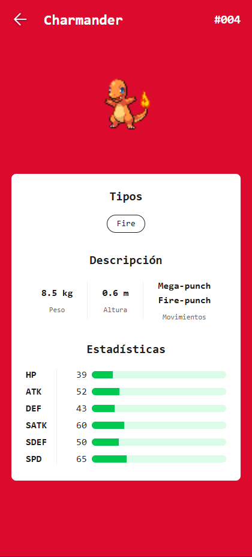
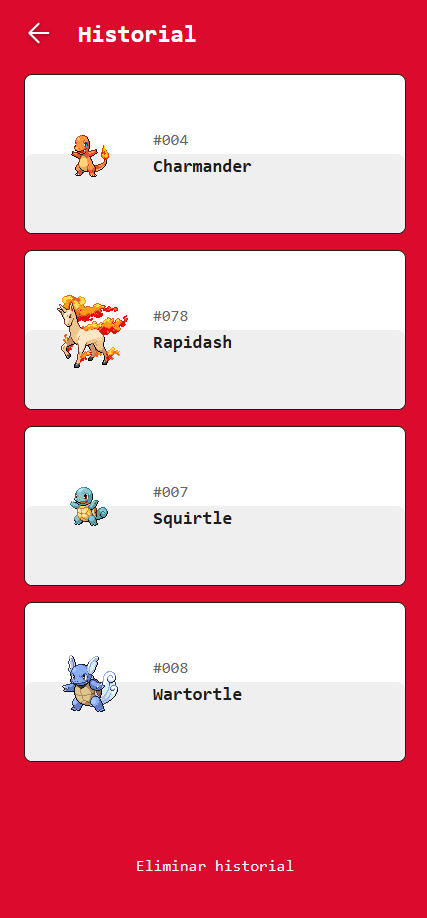

# Encuentra tu Pokemon



> Microfrontend 1 - Detalle de Pokemón



> Microfrontend 2 - Historial de Pokemones

---

## Contenido

-   [Description](#description)
-   [How to use?](#how-to-use)
-   [References](#references)
-   [License](#license)
-   [Author](#author)

---

## Descripción

Aplicación que replica un Pokedex o buscador de Pokemones, contando además con un Historial y el detalle de cada Pokemon.

### Tecnologías

-   Vite
-   React
-   Axios
-   TypeScript
-   HTML
-   TailwindCSS
-   Microfrontends
-   Module Federation

[Go up](#encuentra-tu-pokemon)

---

## ¿Cómo usarlo?

### Instalación:

Ingrese y ejecute la siguiente sentencia en su consola:

```html
npm install
```

### Correr los microfrontends:

Ingrese al microfrontend1 y ejecute la siguiente sentencia en su consola:

```html
npm run build
```

Este microfrontend muestra el detalle de cada pokemon y correra en el puerto 3001.

Luego, ingrese ahora al microfrontend2 y ejecute la siguiente sentencia en su consola:

```html
npm run build
```

Este microfrontend muestra el historial de pokemones vistos y correra en el puerto 3002.

Por último, ingrese al proyecto main y ejecute la siguiente sentencia en su consola:

```html
npm run build
```

para entrar en el modo desarrollador.

Finalmente, abre el puerto [http://localhost:3000](http://localhost:3000) para verlo en su navegador predeterminado.

---

## Licencia

MIT License

Copyright (c) [2021] [Heraldo Fortuna]

Permission is hereby granted, free of charge, to any person obtaining a copy
of this software and associated documentation files (the "Software"), to deal
in the Software without restriction, including without limitation the rights
to use, copy, modify, merge, publish, distribute, sublicense, and/or sell
copies of the Software, and to permit persons to whom the Software is
furnished to do so, subject to the following conditions:

The above copyright notice and this permission notice shall be included in all
copies or substantial portions of the Software.

THE SOFTWARE IS PROVIDED "AS IS", WITHOUT WARRANTY OF ANY KIND, EXPRESS OR
IMPLIED, INCLUDING BUT NOT LIMITED TO THE WARRANTIES OF MERCHANTABILITY,
FITNESS FOR A PARTICULAR PURPOSE AND NONINFRINGEMENT. IN NO EVENT SHALL THE
AUTHORS OR COPYRIGHT HOLDERS BE LIABLE FOR ANY CLAIM, DAMAGES OR OTHER
LIABILITY, WHETHER IN AN ACTION OF CONTRACT, TORT OR OTHERWISE, ARISING FROM,
OUT OF OR IN CONNECTION WITH THE SOFTWARE OR THE USE OR OTHER DEALINGS IN THE
SOFTWARE.

[Go up](#encuentra-tu-pokemon)

---

## Autor

-   Twitter - [@heraldofortuna](https://twitter.com/heraldofortuna)
-   GitHub - [heraldofortuna](https://github.com/heraldofortuna)
-   Linkedin - [heraldofortuna](https://www.linkedin.com/in/heraldo-fortuna/)

[Go up](#encuentra-tu-pokemon)
